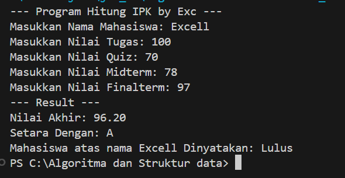
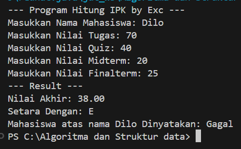

  
# 👋 Halo, Saya [Excell Christian Wulantoro Sadik]

## 🎓 Detail Mahasiswa

| Detail   | Keterangan  |
| -------- | ----------- |
| Nama     | [ExcellChristian] |
| NIM      | [244107020227] |
| Kelas    | [TI-1I]     |
| Angkatan | 2024        |

# Labs #1 Programming Fundamentals Review

## 2.1.1. Selection Solution

The solution is implemented in **Tugas1_1**.java, and below is screenshot of the result.

**Brief explanaton:** There are 4 main step: 
1. Input all grades
2. Validate the input
3. Calculate and convert the final grade
4. Decide the final status