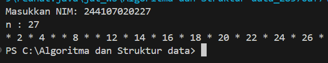
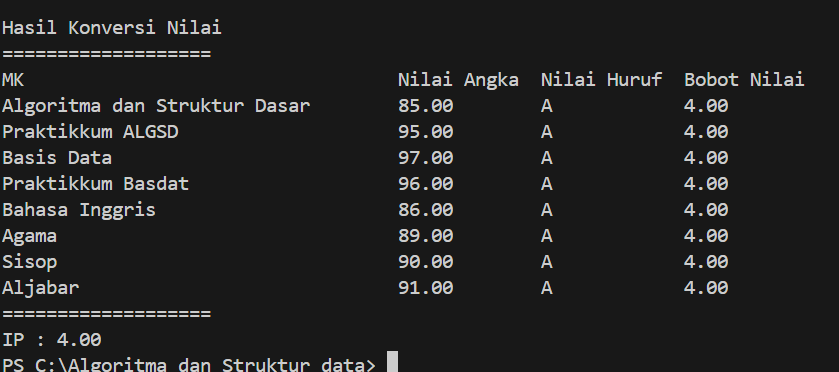
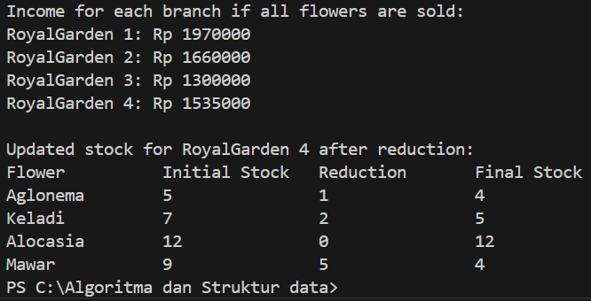

  
# 👋 Halo, Saya [Excell Christian Wulantoro Sadik]

## 🎓 Detail Mahasiswa

| Detail   | Keterangan  |
| -------- | ----------- |
| Nama     | [ExcellChristian] |
| NIM      | [244107020227] |
| Kelas    | [TI-1I]     |
| Angkatan | 2024        |

# Labs #1 Programming Fundamentals Review

## 2.1.1. Selection Solution

The solution is implemented in **Tugas1_1**.java, and below is screenshot of the result.

**Brief explanation:** There are 4 main step: 
1. Input all grades
2. Validate the input
3. Calculate and convert the final grade
4. Decide the final status

## 2.2.1. Looping Solution

The solution is implemented in **Tugas2_2.java**, and below is screenshot of the result.

**Brief explanation:**

1. NIM is inputed as a string
2. The string is then parse into an int variable called n
3. Then using substring and subtracting 2 from the NIM we can check wether the NIM inputed now in n variable is less or more than 10 digits
4. Using substring, it extract the last two digit of the NIM, and if n is less than 10, add 10 value to it by using if function
5. To see the output, we use for loop
6. Inside the for loop, there's an if function to skip number 6 and 10
7. The output of odd number will be replaced by the '*' character using modulus operation, and the even number will be print out normally
8. This will iterate from 1 until the n number or the last 2 digits of the NIM

## 2.3.1. Array Solution

The solution is implemented in **Tugas3_3.java**, and below is screenshot of the result.

**Brief explanation:**
1. Array containing Course name and it's credit already hardcoded into the program, the user input array numerical grade that is going to be put inside another array for numerical grade, while input for letter grade and it's GPA value will be inputed into each of it's own array using if else and witch function
2. A for loop is used to iterate check on if the grade is valid or not, and
3. Inside the loop there are if else function to check each course with a letter grade grade based on numerical grade the user inputted
4. Switch case function is used to assign each course with it's letter grade 
5. The final GPA is calculated using the formula and the information collected by the program form the user inputs.
6. The output use for loop and padding format to display the result in tabular form.

## 2.4.1. Function Solution

The solution is implemented in **Tugas4_4.java**, and below is screenshot of the result.

**Brief explanation:**  
It will be a little bit more complex, because I added few more features

1. Two dimensional array is used to store the stock of each branch. With the row stands for the braches and the column stands for the stock of flower
2. Using a function we calculate the total earning of each branch
3. Then asked the user wether they want to knows how much of the stock remain if there's a reduction (dead flowers)
4. When the user pick a branh (branch 4 from the question) then it will display the remaining stock after reduction